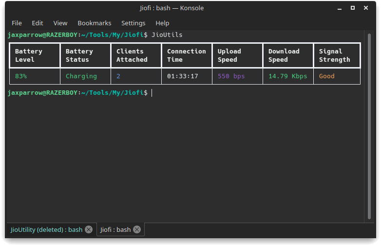

# JioFi Hotspot
```
With this you can view basic information of your jio hotspot provided in jiofi.local.html.
You can view the information easily by calling the Python script ( JioUtils ) anywhere once installed.
Easy to understand UI and tables. Based on Web Scraping.
```
<br>



# Getting started

## Installation


> chmod +x setup.sh

> sudo ./install.sh --install

## Uninstallation


> sudo ./setup.sh --uninstall

***

# JioUtils execution

```
To run the JioUtils
execute the following command anywhere.
```

> JioUtils


***
